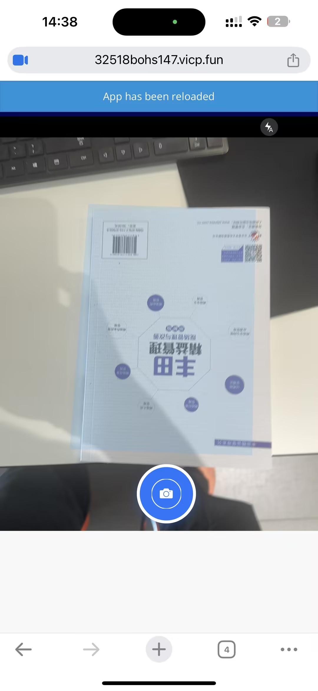
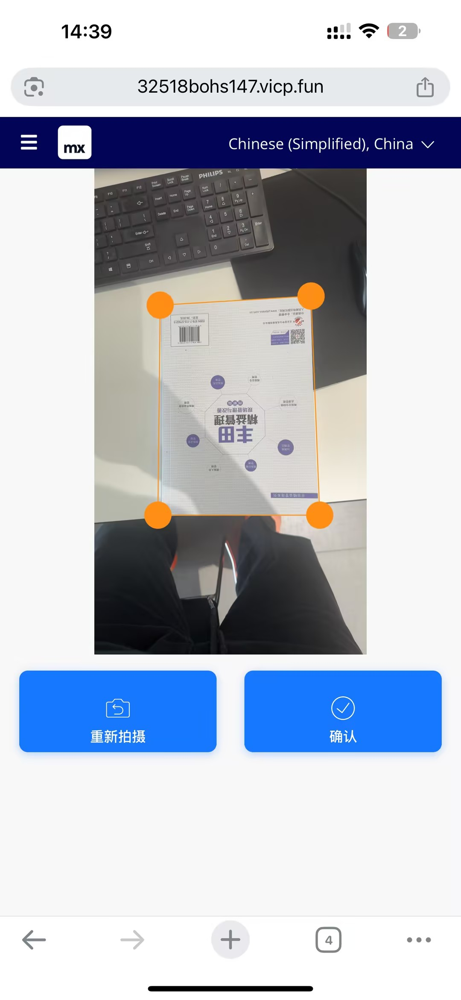
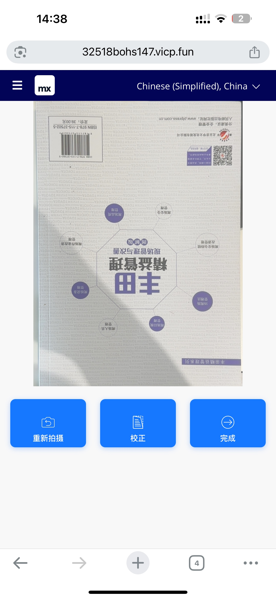

## Document Scanner — Mendix Pluggable Widget

Dynamsoft-powered mobile document scanning for Mendix web apps. This widget opens a complete capture flow (camera, bounds detection, optional smart/auto capture), provides a correction step (drag corners), and shows a final result view. The corrected image is saved as a base64 JPEG string in your Mendix entity.

### Demo

These screenshots illustrate the flow in-app:







## Features

- Auto and manual capture with document bounds detection
- Smart Capture and Auto Crop modes (optional)
- In-app correction and result views
- Outputs base64 JPEG to a Mendix String attribute
- CDN by default, optional self-host resources
- Localizable UI labels (Chinese defaults included)

## Requirements

- Node.js >= 16
- Mendix Studio Pro (Pluggable Widgets)
- Dynamsoft license key

## Build and Package

```bash
npm install
npm run dev        # web preview
npm run start      # dev server for local Mendix app
npm run build      # build web widget
npm run release    # produce .mpk in dist/
```

The packaged widget will be available under `dist/1.x.x/labull.DocumentScanner.mpk`.

## Using in a Mendix App

1. Import `labull.DocumentScanner.mpk` into your Mendix project.
2. Place the widget on a page with an entity context.
3. Configure the properties below.

### Key Properties

- General
  - `license` (required): Dynamsoft license key.
  - `scannedImageAttribute` (required): String attribute to store the base64 JPEG.
  - `heightPercentage` (default 56): Wrapper height as percentage of width (e.g., 56 ≈ 16:9).
- Events
  - `onDone` (optional): Action executed after a successful scan. Use the bound attribute to access the result.
- Advanced (Self-hosting)
  - `uiPath` (optional): Full URL/path to `document-scanner.ui.html`. Leave empty to use CDN.
  - `engineRootPath` (optional): Base URL/path to `libs/` root for Dynamsoft engine resources. Leave empty to use CDN.
- Text (optional)
  - `textTakePhoto`, `textClose`, `textRetake`, `textDone`, `textDetectBorders`, `textAutoCrop`, `textSmartCapture`, `textUploadImage`.

## How It Works

Internally the widget initializes the Dynamsoft engine and three views:
- ScannerView: opens the camera; supports bounds detection, Smart Capture, Auto Crop.
- CorrectionView: lets users adjust the quadrilateral.
- ResultView: renders the corrected image and provides Done/Retake/Correct.

On success, the corrected image is converted to base64 (JPEG) and written to your `scannedImageAttribute`. Then `onDone` (if set) is executed.

## Self-hosting Resources (Optional)

Works out-of-the-box via CDN. If you must self-host, the repo includes a ready structure at `self hosted resources/dynamsoft-resources-download/`.

- Suggested configuration when self-hosting:
  - UI Template Path (`uiPath`):
    - `self hosted resources/dynamsoft-resources-download/document-scanner.ui.html`
  - Engine Resources Root (`engineRootPath`):
    - `self hosted resources/dynamsoft-resources-download/libs/`

Ensure the `libs/` folder contains versioned packages like `dynamsoft-capture-vision-bundle@3.0.6001/dist/...` and is publicly readable if hosted remotely. Leave both fields empty to fall back to CDN.

## Troubleshooting

- Resource 403/404/Unexpected token
  - Check that your self-host URLs return JS/WASM assets (not an HTML error page)
  - Verify public-read and CORS when hosting on object storage/CDN
  - Clear `uiPath`/`engineRootPath` to revert to CDN

## License

This widget is Apache-2.0. Dynamsoft libraries require a valid license.


## 关于 兰博基尼

本项目由兰博基尼团队维护，旨在为 Mendix 提供高质量的移动文档扫描能力示例与最佳实践，支持 CDN 与自托管两种资源加载方式，便于在合规、离线与跨区域网络环境下稳定运行。

